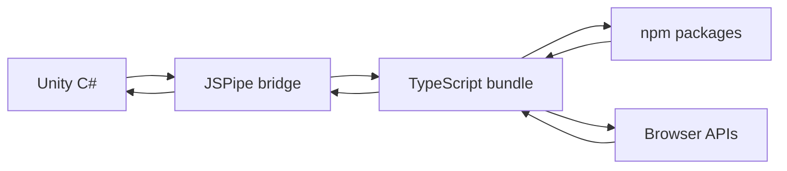
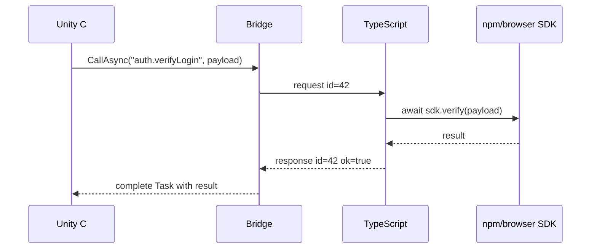

# Unity WebGL, TypeScript и npm: как я устал от `.jslib` и написал мост между C# и браузером

> Черновик технической статьи для Хабра.
>
> Тон статьи: инженерный разбор с личной историей. Не "посмотрите мой ассет", а "вот реальная боль Unity WebGL, вот как я ее решал, вот какие компромиссы пришлось принять".

## Коротко

Unity WebGL на первый взгляд выглядит как обычная сборка Unity-проекта в браузер. Нажал Build, получил страницу, открыл, игра или приложение запустились. Но стоит выйти за пределы "отрисовать сцену и обработать ввод", как быстро выясняется: WebGL-сборка живет в браузере, а значит рядом лежит огромный мир JavaScript, TypeScript, npm-пакетов, SDK, аналитики, wallet-провайдеров, IndexedDB, WebRTC, Web Bluetooth, Web Crypto, фронтенд-фреймворков и всего остального.

И вот тут начинается странное.

Unity вроде бы уже внутри браузера. JavaScript вроде бы рядом. Но нормально разговаривать между C# и современным JS/TS-кодом не так удобно, как хотелось бы.

Официальный путь существует: `.jslib`, `DllImport("__Internal")`, `SendMessage`, немного ручной сериализации, немного глобальных функций, немного магии Emscripten. Для простого вызова это работает. Для реального проекта с async-кодом, npm-зависимостями, ошибками, типами и несколькими модулями превращается в отдельный слой боли.

Из этой боли я и написал **JSPipe**: мост для Unity WebGL, который позволяет строить более нормальную границу между C# в Unity и TypeScript/npm-кодом в браузере.

Эта статья не столько про конкретный ассет, сколько про проблему, архитектуру решения и те углы, об которые я успел удариться.

## Почему это вообще проблема

Unity-разработчик часто воспринимает WebGL как еще одну платформу рядом с Windows, Android или iOS. В каком-то смысле так и есть: Unity компилирует C# через IL2CPP, Emscripten собирает все в WebAssembly/JavaScript, браузер запускает результат.

Но браузер - это не просто "плеер для Unity". Это отдельная платформа со своими API, жизненным циклом, политиками безопасности, моделью памяти, загрузкой ресурсов и экосистемой.

Типичные задачи, которые внезапно требуют общения с JavaScript:

- вызвать npm SDK аналитики или рекламы;
- авторизовать пользователя через внешний веб-сервис;
- открыть wallet-провайдер или web3 SDK;
- работать с Clipboard API, Web Share API, IndexedDB или localStorage;
- встроить Unity-приложение в существующий React/Vue/Svelte-фронтенд;
- прокинуть события из HTML-обвязки в Unity;
- получить данные из TypeScript-кода и вернуть результат обратно в C#;
- обработать Promise и нормально передать ошибку в Unity.

Если нужно один раз дернуть `alert("hello")`, проблем нет. Если нужно построить нормальный integration layer, начинаются вопросы.

## Как это обычно делается в Unity

Классический способ выглядит примерно так.

На стороне Unity:

```csharp
using System.Runtime.InteropServices;
using UnityEngine;

public class BrowserBridge : MonoBehaviour
{
    [DllImport("__Internal")]
    private static extern void TrackEvent(string eventName);

    public void SendEvent()
    {
        TrackEvent("level_started");
    }
}
```

На стороне `.jslib`:

```javascript
mergeInto(LibraryManager.library, {
  TrackEvent: function (eventNamePtr) {
    const eventName = UTF8ToString(eventNamePtr);
    window.analytics.track(eventName);
  }
});
```

Для маленьких интеграций это нормально. Даже приятно: понятно, явно, минимум инфраструктуры.

Но теперь добавим реальный мир.

Что, если `window.analytics.track` возвращает `Promise`?

Что, если передать надо не строку, а объект?

Что, если ответ тоже объект?

Что, если npm-пакет собирается как ESM-модуль?

Что, если нам нужна типизация на стороне TypeScript?

Что, если функция может упасть, а ошибку надо вернуть обратно в C#?

Что, если вызовов много, и каждый раз руками писать `.jslib`-обертку уже неприятно?

Очень быстро bridge перестает быть "парой функций" и становится настоящим транспортным слоем.

## `.jslib` хорош, пока он маленький

Главная проблема не в том, что `.jslib` плохой. Он как раз делает свою работу: дает Unity способ встроить JavaScript в WebGL-билд.

Проблема в том, что `.jslib` - слишком низкоуровневый инструмент для многих современных задач.

У него есть несколько неприятных ограничений:

- код легко превращается в набор глобальных функций;
- нет нормального TypeScript-контракта между C# и JS;
- npm-пакеты не подключаются "естественно";
- async-код приходится оборачивать вручную;
- ошибки часто теряются или превращаются в строки в консоли;
- сложные payload'ы требуют ручной сериализации;
- сложно поддерживать единый стиль вызовов, если интеграций много;
- связь C# -> JS и JS -> C# часто получается асимметричной.

Отдельно неприятно то, что WebGL-ошибки часто проявляются поздно: не в IDE, не при компиляции, а уже в браузере после сборки. Чем больше ручного glue-кода, тем выше шанс получить ошибку вида "undefined is not a function" где-нибудь в production build.

## Что мне хотелось получить

Я хотел, чтобы взаимодействие между Unity и браузерным кодом было похоже не на набор хаотичных дырок в runtime, а на понятный канал связи.

Примерно такие требования:

- C# должен уметь вызвать TypeScript-функцию и получить ответ;
- TypeScript должен уметь вызвать C#-обработчик или отправить событие;
- async-вызовы должны быть нормальной частью модели, а не исключением;
- payload должен передаваться как структурированные данные;
- ошибки должны возвращаться вызывающей стороне;
- npm-пакеты должны подключаться через привычный frontend-tooling;
- мост должен встраиваться в Unity WebGL build без ручного шаманства каждый раз;
- TypeScript должен оставаться TypeScript, а не превращаться в большой `.jslib`-файл.

Ключевая мысль была простая: мне не нужен еще один способ вызвать одну JS-функцию. Мне нужен слой сообщений.

## От вызова функции к протоколу

Когда таких интеграций становится больше двух-трех, полезно перестать думать категориями "C# вызывает JS-функцию". Лучше думать категориями "две среды обмениваются сообщениями".

С одной стороны:

- Unity runtime;
- C#-код;
- IL2CPP;
- WebAssembly;
- ограничения Unity WebGL.

С другой:

- браузер;
- JavaScript runtime;
- TypeScript;
- npm-зависимости;
- DOM и browser API.

Между ними нужна труба, которая умеет:

- присвоить вызову идентификатор;
- сериализовать payload;
- доставить сообщение на другую сторону;
- вызвать нужный handler;
- дождаться результата, если handler асинхронный;
- вернуть success/error;
- связать ответ с исходным запросом.

В самом примитивном виде это похоже на RPC:

```text
C# -> JS
{
  "id": "42",
  "method": "analytics.track",
  "payload": {
    "event": "level_started",
    "level": 3
  }
}

JS -> C#
{
  "id": "42",
  "ok": true,
  "result": null
}
```

На практике деталей больше, но идея именно такая: не плодить уникальные мостики под каждую функцию, а сделать один общий механизм.

## Где тут TypeScript

TypeScript важен не потому, что "модно". Он важен потому, что граница между Unity и браузером - одно из самых хрупких мест проекта.

Когда C# передает строку с JSON в JS, а JS потом что-то возвращает обратно, очень легко получить ошибку контракта:

- поле называется `userId`, а ожидается `userID`;
- число приехало строкой;
- объект содержит `null`, который C#-модель не ожидала;
- метод переименовали на одной стороне, а на другой забыли;
- ошибка в npm SDK всплыла как непонятный rejected Promise.

TypeScript не решает все это магически, но позволяет сделать JS-сторону явной:

```ts
type TrackEventRequest = {
  event: string;
  properties?: Record<string, unknown>;
};

type TrackEventResponse = {
  accepted: boolean;
};

export async function trackEvent(
  request: TrackEventRequest
): Promise<TrackEventResponse> {
  await analytics.track(request.event, request.properties ?? {});

  return {
    accepted: true
  };
}
```

Теперь этот код можно собирать нормальным frontend-инструментом, импортировать npm-пакеты и проверять хотя бы половину контракта до запуска WebGL-билда.

## Где тут npm

Вот это, пожалуй, самый приятный момент.

В браузерном мире почти любая интеграция уже существует как npm-пакет. Но Unity-проект исторически живет в другой экосистеме. В итоге разработчик оказывается между двумя мирами:

- Unity хочет C# и свои build settings;
- браузерные SDK хотят npm, bundler, modules, TypeScript, ESM/CJS и свой lifecycle.

JSPipe был задуман как способ сделать этот разрыв меньше.

Например, условный TypeScript-код может выглядеть так:

```ts
import { z } from "zod";

const PurchaseRequest = z.object({
  productId: z.string(),
  quantity: z.number().int().positive()
});

export async function validatePurchase(payload: unknown) {
  const request = PurchaseRequest.parse(payload);

  return {
    productId: request.productId,
    quantity: request.quantity,
    valid: true
  };
}
```

Для frontend-разработчика это обычный код. Для Unity-разработчика это возможность использовать зрелую npm-экосистему без переписывания всего на C# или ручного копирования минифицированного JS в `.jslib`.

## Пример сценария: Unity вызывает npm-пакет

Допустим, у нас есть Unity WebGL-приложение, и мы хотим проверить данные на стороне браузера через npm-библиотеку. В реальном проекте вместо validation package может быть что угодно: SDK платежей, аналитика, wallet connector, crypto, QR-генератор, работа с IndexedDB.

На стороне TypeScript мы пишем обычный модуль:

```ts
import { z } from "zod";

const LoginRequest = z.object({
  userId: z.string(),
  token: z.string()
});

export async function verifyLogin(payload: unknown) {
  const request = LoginRequest.parse(payload);

  const response = await fetch("/api/session/verify", {
    method: "POST",
    headers: {
      "Content-Type": "application/json"
    },
    body: JSON.stringify(request)
  });

  if (!response.ok) {
    throw new Error(`Session verification failed: ${response.status}`);
  }

  return await response.json();
}
```

На стороне Unity хочется вызывать это примерно так:

```csharp
var result = await bridge.CallAsync<LoginResult>(
    "auth.verifyLogin",
    new
    {
        userId = currentUserId,
        token = sessionToken
    }
);

Debug.Log($"Logged in as {result.DisplayName}");
```

Важная часть здесь не конкретный синтаксис. Важная часть - модель:

- C# вызывает именованный метод;
- payload сериализуется;
- TypeScript handler получает структурированные данные;
- внутри handler можно использовать `fetch`, npm-пакеты и browser API;
- `Promise` нормально ожидается;
- результат возвращается обратно в C#;
- ошибка не пропадает, а превращается в ошибочный ответ.

## Почему async особенно неприятен

JavaScript живет в мире `Promise`. Unity/C# живет в мире `Task`, корутин и игрового цикла. На бумаге это похоже: и там, и там есть асинхронность. На практике граница между ними не бесплатная.

На JS-стороне:

```ts
export async function loadProfile(userId: string) {
  const response = await fetch(`/api/users/${userId}`);

  if (!response.ok) {
    throw new Error("Failed to load profile");
  }

  return await response.json();
}
```

На C#-стороне хочется не подписываться на пять callback'ов, а написать:

```csharp
try
{
    var profile = await bridge.CallAsync<UserProfile>(
        "profile.load",
        new { userId }
    );

    ApplyProfile(profile);
}
catch (Exception exception)
{
    Debug.LogError(exception);
    ShowProfileError();
}
```

Чтобы это работало, мост должен хранить таблицу pending-вызовов. Каждый запрос получает `id`. Когда приходит ответ, по `id` находится ожидающий вызов, после чего он завершается успехом или ошибкой.

Это звучит просто, но именно такие "простые" вещи лучше один раз сделать в инфраструктуре, чем копировать в каждый проект.

## Ошибки важнее happy path

На первых прототипах мостов почти всегда проверяют только happy path:

1. C# вызвал JS.
2. JS вернул строку.
3. Unity вывела `Debug.Log`.

И кажется, что задача решена.

Но настоящий bridge проверяется ошибками:

- handler не найден;
- payload не распарсился;
- npm SDK выбросил исключение;
- `fetch` вернул 500;
- пользователь закрыл popup авторизации;
- Unity instance еще не готов;
- JS уже загрузился, а C#-обработчики еще не зарегистрированы;
- пришел ответ на неизвестный request id;
- WebGL build работает иначе, чем editor-заглушка.

Если ошибки не являются частью протокола, они превращаются в шум в browser console. Пользователь видит зависший экран, Unity-разработчик видит "что-то не вызвалось", а настоящая причина лежит на другой стороне границы.

Поэтому для меня было важно, чтобы ответ имел две формы:

```json
{
  "id": "42",
  "ok": true,
  "result": {
    "displayName": "Alex"
  }
}
```

или:

```json
{
  "id": "42",
  "ok": false,
  "error": {
    "message": "Session verification failed: 401",
    "name": "Error"
  }
}
```

Даже если на C#-стороне это потом превращается в обычное исключение, важно, что ошибка не исчезла.

## Инициализация: кто кого ждет

Еще один неочевидный слой - порядок загрузки.

В браузере есть:

- HTML-страница;
- Unity loader;
- WebAssembly;
- generated JavaScript;
- пользовательский JS/TS bundle;
- Unity scene lifecycle;
- C# `Awake`, `Start`, регистрации обработчиков;
- внешние SDK, которые тоже могут грузиться асинхронно.

Если JS попробует отправить сообщение в Unity до того, как Unity instance готов, сообщение потеряется. Если Unity попробует вызвать TypeScript handler до того, как bundle зарегистрировал методы, вызов упадет. Если внешний SDK еще не инициализирован, handler может быть найден, но не сможет выполнить работу.

Поэтому bridge должен отвечать не только на вопрос "как вызвать метод", но и на вопрос "когда уже можно вызывать".

В простом варианте можно иметь handshake:

```text
JS runtime loaded
TS handlers registered
Unity instance ready
C# handlers registered
Bridge ready
```

Только после этого обе стороны могут считать канал готовым.

## Почему сборка важна не меньше runtime

Большая часть боли в Unity WebGL interop находится не только во время выполнения, но и во время сборки.

Если TypeScript лежит отдельно, npm-зависимости отдельно, Unity build отдельно, а `.jslib` пишется вручную, проект быстро становится хрупким:

- непонятно, кто и когда собирает TS;
- непонятно, куда класть bundle;
- легко забыть обновить generated-файл;
- dev- и prod-режимы начинают отличаться;
- Unity-разработчик боится трогать frontend-часть;
- frontend-разработчик не понимает, как это попадет в WebGL build.

Поэтому в JSPipe я хотел сделать не только runtime-мост, но и понятный build flow. TypeScript должен собираться в JavaScript, npm-зависимости должны попадать в bundle, а Unity WebGL должен получать готовый glue-код в ожидаемом формате.

В этом месте хорошо ложится `esbuild`: быстрый, простой, достаточно гибкий для задачи "собрать TS/npm-код в браузерный bundle".

## Почему не просто React вокруг Unity

Иногда можно услышать: "Если нужна браузерная логика, просто заверните Unity WebGL в React-приложение".

Это действительно рабочий путь для части проектов. Но он не отменяет проблему связи.

Даже если Unity живет внутри React-страницы, все равно нужно:

- отправлять события из Unity во frontend;
- отдавать frontend-состояние в Unity;
- вызывать browser SDK из Unity-кода;
- синхронизировать lifecycle;
- обрабатывать ошибки между двумя runtime.

React, Vue или Svelte могут быть отличной оболочкой. Но им все равно нужен контракт с Unity. JSPipe как раз про этот контракт.

## Что получилось в итоге

В итоге JSPipe для меня стал способом привести Unity WebGL interop к более привычной инженерной модели:

- C# и TypeScript общаются через единый канал;
- вызовы выглядят как request/response;
- async является нормальным сценарием;
- npm-пакеты можно использовать в TS-части;
- `.jslib` и `.jspre` остаются инфраструктурой, а не местом, где пишется вся бизнес-логика;
- build flow становится повторяемым;
- ошибки можно передавать осмысленно, а не искать их по косвенным признакам.

Это не отменяет ограничений WebGL. Браузер по-прежнему остается браузером. Unity WebGL по-прежнему имеет свои особенности. Но граница между двумя мирами становится менее болезненной.

## Где такой подход особенно полезен

Я бы рассматривал такой bridge в проектах, где Unity WebGL - не изолированная игрушка в iframe, а часть более широкой веб-системы.

Например:

- интерактивные 3D-конфигураторы товаров;
- WebGL-игры с внешней авторизацией и платежами;
- образовательные симуляторы внутри LMS;
- browser-based CAD/visualization tools;
- проекты с wallet/web3-интеграциями;
- приложения, где Unity отвечает за визуальную часть, а бизнес-логика и аккаунт живут во frontend/backend-экосистеме;
- прототипы, где нужно быстро использовать существующий npm SDK.

Если Unity-приложение вообще не общается с внешним миром, такой слой может быть избыточным. Но как только появляются несколько интеграций, инфраструктурный bridge начинает окупаться.

## Какие компромиссы остаются

Честно: мост между C# и TypeScript не превращает WebGL в нативную платформу.

Остаются ограничения:

- все данные на границе нужно сериализовать;
- большие payload'ы требуют аккуратности;
- browser API зависят от HTTPS, user gesture и политик безопасности;
- некоторые SDK плохо живут внутри iframe;
- WebGL build сложнее отлаживать, чем обычный C# в Editor;
- типы между C# и TypeScript все равно нужно синхронизировать дисциплиной или генерацией;
- нельзя забывать про порядок инициализации.

Но, на мой взгляд, хороший bridge хотя бы собирает эти проблемы в одном месте. А это уже сильно лучше, чем размазывать их по десяткам `.jslib`-функций.

## Что я бы улучшал дальше

Есть несколько направлений, которые хочется развивать:

- генерация TypeScript-типов из C# DTO или наоборот;
- строгая схема контрактов для bridge-вызовов;
- devtools-панель для просмотра сообщений между Unity и JS;
- более удобный mock-режим для Unity Editor;
- автоматические тесты bridge-протокола в headless-браузере;
- шаблоны интеграций для популярных browser SDK;
- более подробная диагностика WebGL build pipeline.

Особенно интересна генерация контрактов. Сейчас многие interop-ошибки можно поймать только дисциплиной и тестами. Если же C# и TypeScript будут получать типы из одного источника, граница станет заметно надежнее.

## Вывод

Unity WebGL - это не только Unity, запущенный в браузере. Это точка пересечения двух больших экосистем: C#-мира и JavaScript/TypeScript/npm-мира.

Пока проект маленький, можно жить на прямых `.jslib`-вызовах. Но если интеграций становится больше, если появляются `Promise`, npm SDK, browser API, события, ошибки и внешняя HTML-обвязка, простые вызовы быстро превращаются в хрупкую инфраструктуру.

Мой вывод после работы над JSPipe такой: для Unity WebGL нужен не "еще один хелпер для вызова JS", а нормальный слой коммуникации. С идентификаторами запросов, async-моделью, ошибками, сборкой TypeScript и понятным местом для npm-кода.

И если этот слой сделать один раз аккуратно, Unity WebGL начинает ощущаться не как закрытая коробка, которая случайно оказалась в браузере, а как полноценный участник веб-приложения.

## Возможный финальный абзац для Хабра

JSPipe вырос из довольно практической боли: мне хотелось писать Unity WebGL-интеграции так, чтобы не стыдно было возвращаться к ним через месяц. Не искать глобальную функцию в `.jslib`, не гадать, где потерялся Promise, не копировать npm-код руками, а иметь понятный канал между C# и TypeScript.

Если вы делали сложные WebGL-интеграции в Unity, интересно узнать, где у вас болело сильнее всего: `.jslib`, async, npm, порядок инициализации, iframe, внешние SDK или что-то еще?

## Идеи для иллюстраций

Можно добавить 2-3 простые схемы:





## Более цепкие варианты заголовка

- Unity WebGL и TypeScript: как я построил мост между C# и npm
- Почему `.jslib` перестает хватать в Unity WebGL-проектах
- Unity в браузере: нормальный interop между C#, TypeScript и npm
- Как я подружил Unity WebGL с TypeScript и npm-пакетами
- Unity WebGL без боли: RPC-мост между C# и браузерным JavaScript

## Что можно добавить перед публикацией

Перед публикацией стоит заменить условные примеры API на реальные фрагменты из JSPipe:

- реальный C# вызов;
- реальная регистрация TypeScript handler;
- кусок настройки сборки;
- скриншот структуры проекта;
- пример ошибки и как она выглядит в Unity;
- мини-демо с npm-пакетом;
- ссылку на страницу ассета в Unity Asset Store.

