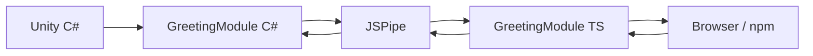
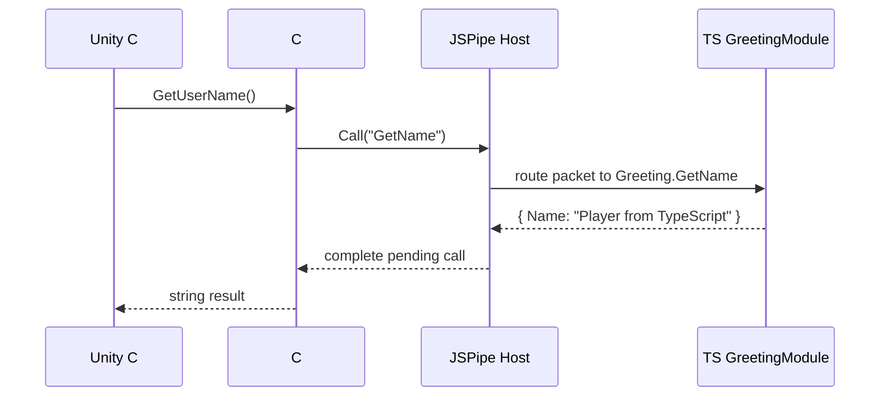

# JSPipe для Unity WebGL: сценарий видео-туториала

> Формат: обучающее видео на 12-18 минут.
>
> Цель: показать, зачем нужен JSPipe, как его подключить, как сделать первый обмен сообщениями между C# и TypeScript, как использовать npm-зависимость и что происходит при WebGL build.

## 0. Название видео

**Unity WebGL + TypeScript + npm: настраиваем JSPipe и делаем первый bridge между C# и браузером**

Альтернативы:

- **Как подключить TypeScript и npm к Unity WebGL через JSPipe**
- **Unity WebGL без боли: C# вызывает TypeScript, TypeScript отвечает в Unity**
- **JSPipe tutorial: bridge между Unity C# и browser runtime**

## 1. Вступление, 0:00-0:50

### На экране

- Unity project с WebGL target.
- Рядом открыть браузер или страницу WebGL build.
- Коротко показать Asset Store page или package folder в проекте.

### Текст ведущего

Всем привет. В этом видео я покажу, как использовать JSPipe - ассет для Unity WebGL, который помогает связать C#-код внутри Unity с TypeScript и npm-кодом в браузере.

Если вы уже делали WebGL-интеграции в Unity, вы скорее всего сталкивались с `.jslib`, `DllImport("__Internal")`, `SendMessage`, ручной сериализацией и странными ошибками, которые всплывают уже после WebGL build.

JSPipe решает эту задачу чуть иначе: вместо набора глобальных JS-функций он дает модульный bridge. C# и TypeScript общаются через модули, методы, payload, `Notify` и `Call`.

Сегодня мы сделаем минимальный пример: Unity вызовет TypeScript-метод, TypeScript вернет ответ, а затем TypeScript отправит событие обратно в Unity.

## 2. Что мы соберем, 0:50-1:30

### На экране

Показать итоговую схему или слайд:



### Текст ведущего

В конце у нас будет модуль `Greeting`.

На C# стороне он сможет вызвать TypeScript-метод `GetName` и получить ответ.

На TypeScript стороне тот же модуль сможет отправить в Unity событие `SayHello`.

Потом я покажу, где настраиваются npm-зависимости, чем отличаются `main` и `template` entry points, и как JSPipe встраивается в WebGL build.

## 3. Коротко о модели JSPipe, 1:30-2:30

### На экране

Слайд или текст в редакторе:

```text
Module name: Greeting

C#:
  RegisterHandler("SayHello")
  Call("GetName")

TypeScript:
  registerHandler("GetName")
  notify("SayHello")
```

### Текст ведущего

Главная идея JSPipe - не вызывать отдельные глобальные JS-функции, а общаться через модули.

Модуль должен существовать на обеих сторонах и называться одинаково. Например, `Greeting`.

Внутри модуля есть методы. Для событий без ответа используется `Notify`. Для запросов, где нужен результат, используется `Call`.

То есть если C# вызывает `Call("GetName")`, TypeScript-сторона должна зарегистрировать handler `GetName` в модуле с тем же именем.

Это похоже на маленький RPC-слой между Unity runtime и browser runtime.

## 4. Инициализация JSPipe в Unity, 2:30-3:30

### На экране

Unity Project window. Создать или открыть `Bootstrap.cs`.

### Код

```csharp
using TiltShift.JsPipe;
using UnityEngine;

public class Bootstrap : MonoBehaviour
{
    private void Awake()
    {
#if UNITY_WEBGL && !UNITY_EDITOR
        JsPipeHost.Init();
#endif
    }
}
```

### Действия

1. Создать GameObject `Bootstrap`.
2. Повесить на него компонент `Bootstrap`.
3. Сохранить сцену.

### Текст ведущего

Сначала нужно инициализировать bridge на C# стороне.

Для этого достаточно один раз вызвать `JsPipeHost.Init`.

Я оборачиваю вызов в `UNITY_WEBGL && !UNITY_EDITOR`, потому что JSPipe работает именно в WebGL build. В Editor обычно делают mock-слой или просто не вызывают browser integration.

Теперь при запуске WebGL build JSPipe host будет готов принимать и отправлять пакеты.

## 5. C# модуль, 3:30-5:20

### На экране

Создать `GreetingModule.cs`.

### Код

```csharp
using Cysharp.Threading.Tasks;
using TiltShift.JsPipe;
using UnityEngine;

public class GreetingModule : JSPipeModule
{
    public override string Name => "Greeting";

    public GreetingModule()
    {
        RegisterHandler<NameRequest>("SayHello", OnSayHello);
    }

    private void OnSayHello(NameRequest request)
    {
        Debug.Log($"Hello from TypeScript: {request.Name}");
    }

    public async UniTask<string> GetUserName()
    {
        var response = await Call<NameResponse>("GetName");
        return response.Name;
    }

    private class NameRequest
    {
        public string Name { get; set; }
    }

    private class NameResponse
    {
        public string Name { get; set; }
    }
}
```

### Текст ведущего

Теперь создадим первый модуль на C# стороне.

Он наследуется от `JSPipeModule`, а его имя - `Greeting`. Это имя важно: TypeScript-модуль должен называться точно так же.

В конструкторе мы регистрируем handler `SayHello`. Это метод, который сможет вызвать TypeScript.

А метод `GetUserName` делает обратное: вызывает TypeScript handler `GetName` и ждет ответ.

Обратите внимание на разделение: входящий вызов регистрируется через `RegisterHandler`, исходящий request делается через `Call`.

## 6. Использование C# модуля из MonoBehaviour, 5:20-6:30

### На экране

Создать `GreetingDemo.cs`.

### Код

```csharp
using Cysharp.Threading.Tasks;
using UnityEngine;

public class GreetingDemo : MonoBehaviour
{
    private GreetingModule _greetingModule;

    private void Awake()
    {
        _greetingModule = new GreetingModule();
    }

    private async void Start()
    {
#if UNITY_WEBGL && !UNITY_EDITOR
        await UniTask.Delay(1000);

        var name = await _greetingModule.GetUserName();
        Debug.Log($"Name from TypeScript: {name}");
#endif
    }
}
```

### Действия

1. Создать GameObject `GreetingDemo`.
2. Повесить компонент.
3. Сохранить сцену.

### Текст ведущего

Теперь создадим MonoBehaviour, который будет использовать наш модуль.

В `Awake` мы создаем экземпляр `GreetingModule`. Модуль регистрируется автоматически, поэтому отдельно добавлять его в host не нужно.

В `Start` немного подождем и вызовем `GetUserName`. Для реального проекта лучше завязаться на состояние готовности bridge, но для первого демо задержки достаточно, чтобы не смешивать сразу все темы.

## 7. Настройка TypeScript окружения, 6:30-7:40

### На экране

Unity menu:

```text
Tools -> JSPipe -> Install ENV
```

Потом Project window:

```text
Assets/upackage.json
Assets/tsconfig.json
Assets/Index.ts
.npm/
```

### Текст ведущего

Теперь нужна web-сторона.

JSPipe добавляет меню `Tools -> JSPipe`. Команда `Install ENV` создает TypeScript/npm окружение для проекта.

После выполнения появляются `upackage.json`, `tsconfig.json`, entry point `Index.ts` и локальная `.npm` директория с зависимостями.

`upackage.json` здесь играет роль конфигурации web-части. В нем можно указывать entry points и npm dependencies.

Для первого примера нам нужен `main` entry point - код, который будет собран в JS Pre и выполнится рядом с Unity/WebAssembly runtime.

## 8. TypeScript модуль, 7:40-9:10

### На экране

Открыть `Assets/Index.ts`.

### Код

```ts
import { JSPipeModule } from "./jspipe/JSPipeModule";

class GreetingModule extends JSPipeModule {
  constructor() {
    super("Greeting");

    this.registerHandler("GetName", () => {
      return {
        Name: "Player from TypeScript"
      };
    });
  }

  public sayHello(name: string): void {
    this.notify("SayHello", {
      Name: name
    });
  }
}

const greeting = new GreetingModule();

setTimeout(() => {
  greeting.sayHello("Browser runtime");
}, 2000);
```

### Текст ведущего

Теперь создаем такой же модуль на TypeScript стороне.

Ключевая строка здесь - `super("Greeting")`. Имя должно совпадать с C# модулем.

Дальше мы регистрируем handler `GetName`. Именно его вызовет C# через `Call`.

И еще добавим метод `sayHello`, который отправляет уведомление `SayHello` обратно в Unity. На C# стороне мы уже зарегистрировали handler с таким именем.

В конце создаем модуль и через пару секунд отправляем событие в Unity.

## 9. Первый WebGL build, 9:10-10:30

### На экране

Unity Build Settings:

```text
Platform: WebGL
Build
```

Показать Console logs после build.

### Текст ведущего

Теперь собираем проект под WebGL.

Во время сборки JSPipe подготовит JavaScript-часть: соберет `main` entry point в `.jspre`, подготовит WebGL template и подключит нужные скрипты.

После build временные артефакты будут удалены. Это нормально: JSPipe создает их на время сборки, чтобы проект не засорялся generated-файлами.

Открываем билд в браузере и смотрим console.

Мы должны увидеть два события:

1. Unity вызвала TypeScript `GetName` и получила имя.
2. TypeScript отправил `SayHello`, а Unity вывела сообщение в `Debug.Log`.

## 10. Что происходит под капотом, 10:30-11:40

### На экране

Схема:



### Текст ведущего

Под капотом это не прямой вызов C# -> JS-функция.

JSPipe формирует packet: в нем есть request id, имя модуля, имя метода и payload.

Host отправляет packet на другую сторону, там он маршрутизируется в модуль `Greeting`, вызывается handler `GetName`, результат возвращается обратно и завершает ожидающий `Call`.

Именно поэтому такая модель хорошо подходит для async-кода. TypeScript handler может вернуть результат сразу, а может сделать `await fetch`, вызвать npm SDK или дождаться browser API.

## 11. Добавляем npm-зависимость, 11:40-13:20

### На экране

Открыть `Assets/upackage.json`.

### Пример

```json
{
  "main": "./Index.ts",
  "template": "./Template.ts",
  "dependencies": {
    "zod": "^3.23.8"
  }
}
```

### Действия

1. Добавить dependency.
2. Запустить `Tools -> JSPipe -> Install ENV`.
3. Обновить `Index.ts`.

### Код

```ts
import { z } from "zod";
import { JSPipeModule } from "./jspipe/JSPipeModule";

const NameRequest = z.object({
  Name: z.string()
});

class GreetingModule extends JSPipeModule {
  constructor() {
    super("Greeting");

    this.registerHandler("GetName", () => {
      return {
        Name: "Player from npm-enabled TypeScript"
      };
    });
  }

  public sayHello(name: string): void {
    const payload = NameRequest.parse({ Name: name });
    this.notify("SayHello", payload);
  }
}

const greeting = new GreetingModule();
greeting.sayHello("Validated browser payload");
```

### Текст ведущего

Теперь покажем, зачем вообще нужен npm.

В `upackage.json` можно добавить зависимости почти как в обычном `package.json`.

После изменения конфигурации нужно снова выполнить `Install ENV`, чтобы зависимости установились.

Для примера подключим `zod` и провалидируем payload перед отправкой в Unity.

В реальном проекте вместо `zod` здесь может быть analytics SDK, wallet connector, SDK платежей, crypto library, QR generator или любой другой browser-oriented npm package.

## 12. Template entry point, 13:20-14:40

### На экране

Показать:

```text
Assets/JSPipeTemplate/index.html
Assets/Template.ts
Assets/upackage.json
```

### Текст ведущего

У JSPipe есть еще одна важная часть - WebGL template.

Не весь JavaScript должен выполняться рядом с Unity runtime. Иногда код нужен раньше: при загрузке страницы, до запуска WebAssembly.

Для этого в `upackage.json` есть `template` entry point.

Код из `template` собирается и вставляется в итоговый `index.html`. Он подходит для page-level логики: wrapper UI, ранний bootstrap, настройка страницы, работа с HTML до запуска Unity.

А `main` entry point собирается в `.jspre` и используется для bridge/runtime логики.

Это разделение помогает не смешивать HTML-обвязку и код, который общается с Unity.

## 13. Ошибки и диагностика, 14:40-15:50

### На экране

Показать C# override.

### Код

```csharp
public override void OnRxPacket(JsPipePacket packet)
{
    Debug.Log($"[{Name}] Packet received: {packet.Id}");

    base.OnRxPacket(packet);

    if (packet.Response?.Error != null)
    {
        Debug.LogError(packet.Response.Error.Message);
    }
}
```

### Текст ведущего

Когда bridge используется в реальном проекте, важно видеть, что через него проходит.

В JSPipe можно переопределить `OnRxPacket` у модуля и добавить логирование, метрики или централизованную обработку ошибок.

Главное - вызвать `base.OnRxPacket(packet)`, чтобы стандартная обработка пакета продолжила работать.

Это полезно, когда нужно понять: модуль не зарегистрирован, handler упал, payload неверный или ответ просто не пришел.

## 14. Краткое резюме, 15:50-16:40

### На экране

Слайд:

```text
JSPipe:

- C# <-> TypeScript bridge
- modules by name
- Notify for events
- Call for request/response
- npm dependencies through upackage.json
- main -> JSPre
- template -> HTML page script
- WebGL build integration
```

### Текст ведущего

Подведем итог.

JSPipe нужен не для того, чтобы один раз вызвать JavaScript из Unity. Для этого хватит `.jslib`.

Он полезен, когда Unity WebGL становится частью web-приложения: когда нужны TypeScript, npm SDK, async-вызовы, события, HTML template и предсказуемый build flow.

Модель такая:

модули синхронизируются по имени, `Notify` отправляет события, `Call` делает request/response, TypeScript-код собирается через JSPipe environment, а WebGL build получает уже подготовленные JS artifacts.

## 15. Финал, 16:40-17:10

### На экране

- Unity Console с успешными логами.
- Browser console.
- Asset page или project folder.

### Текст ведущего

На этом базовая настройка JSPipe готова.

В следующих видео можно отдельно разобрать более сложные сценарии: авторизацию через browser SDK, wallet connection, работу с template UI, мокирование в Editor и генерацию контрактов между C# и TypeScript.

Если вы используете Unity WebGL и уже упирались в `.jslib`, async или npm-интеграции, попробуйте такой модульный подход. Он не отменяет особенности WebGL, но делает границу между Unity и браузером намного понятнее.

## 16. Чеклист для записи

- Подготовить чистый Unity проект с установленным JSPipe.
- Переключить platform на WebGL заранее.
- Убедиться, что `Cysharp.Threading.Tasks` доступен, если примеры используют `UniTask`.
- Проверить, что `Tools -> JSPipe -> Install ENV` проходит без ошибок.
- Подготовить рабочий `Assets/JSPipeTemplate/index.html`.
- Проверить первый build до записи.
- Открыть browser console и Unity console.
- Подготовить zoom на код, чтобы зрителю было видно имена модулей и handlers.
- Не уходить глубоко в build internals в первом видео.

## 17. Возможные ошибки во время демо

### Не совпадает имя модуля

Симптом: C# вызывает метод, но TypeScript handler не находится.

Что сказать:

> Самая частая ошибка - разные имена модулей. Если на C# `Name => "Greeting"`, то в TypeScript должен быть `super("Greeting")`.

### Handler не зарегистрирован

Симптом: module есть, method не найден.

Что сказать:

> Имя метода тоже является частью контракта. `Call("GetName")` должен соответствовать `registerHandler("GetName", ...)`.

### Забыли `Install ENV` после изменения dependencies

Симптом: npm package не находится при сборке.

Что сказать:

> После изменения `upackage.json` нужно снова выполнить `Tools -> JSPipe -> Install ENV`, чтобы зависимости реально установились.

### Код запустили в Editor

Симптом: browser integration не работает.

Что сказать:

> JSPipe рассчитан на WebGL build. В Editor стоит использовать mock или оборачивать вызовы в `UNITY_WEBGL && !UNITY_EDITOR`.

### Template не найден

Симптом: build template падает.

Что сказать:

> В проекте должен быть `Assets/JSPipeTemplate/index.html`. Для первого демо лучше подготовить его заранее.

## 18. Сценарий короткого Shorts/Reels на 60 секунд

### Текст

Unity WebGL уже работает в браузере, но нормально общаться с TypeScript и npm-кодом не так удобно.

Обычно все начинается с `.jslib`, а потом появляются async, JSON, callbacks, SDK, browser API и ошибки в console.

JSPipe решает это через модульный bridge.

На C# стороне:

```csharp
public override string Name => "Greeting";
var response = await Call<NameResponse>("GetName");
```

На TypeScript стороне:

```ts
super("Greeting");
this.registerHandler("GetName", () => ({ Name: "Player" }));
```

Модули совпадают по имени, методы вызываются через `Call`, события отправляются через `Notify`.

А TypeScript и npm-зависимости собираются прямо в WebGL build flow.

Если Unity WebGL у вас не просто игра в iframe, а часть web-приложения, такой bridge сильно упрощает жизнь.

